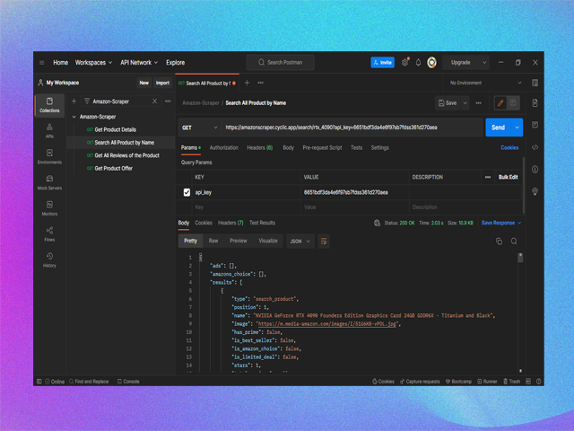

# amazon-scrapper

Amazon web scrapper

  
   
  

    <h3>
      <b>
        Amazon Scraper
      </b>
    </h3>
  

  

    <b>
      Free Scraper for Amazon
    </b>
  

  

  

  

    
      Built with ❤︎ by
      <a href="https://github.com/akunumanarif/amazon-scrapper">
        Nu'man Arif
      </a>
    
  

   
  

    <!--  -->
    
  

### **Features**

⚡️ **Fast:** Get search, products, and reviews responses in real-time.

**HTTP Methods**

- `GET` - Requests search product data
- `GET` - Requests spesific product data
- `GET` - Requests product data reviews
- `GET` - Requests product data offers

🚀 **Request:** Retrieve response from endpoint instantly.

1. Signup to `scraperapi.com`
2. Get your `api_key`
3. Enter your `api_key` into url
4. Send

🔐 **Authorization:** Allows to identify the end-user.

- None from amazonscraper
- Api_key from https://scrapiapi.com

## **Demo**

[https://amazonscraper.cyclic.app](https://amazonscraper.cyclic.app/products/B0BG959RCF?api_key=6651bdf3da4e6f978b7fd9361d270aea)

## **Usage**

- `GET` - Requests search product data
  `https://amazonscraper.cyclic.app/search/rtx_4090?api_key=6651bdf3da4e6f978b7fd9361d270aea`
- `GET` - Requests spesific product data
  `https://amazonscraper.cyclic.app/products/B0BG959RCF?api_key=6651bdf3da4e6f978b7fd9361d270aea`
- `GET` - Requests product data reviews
  `https://amazonscraper.cyclic.app/products/B0BG959RCF/reviews?api_key=6651bdf3da4e6f978b7fd9361d270aea`
- `GET` - Requests product data offers
  `https://amazonscraper.cyclic.app/products/B0BG959RCF/offers?api_key=6651bdf3da4e6f978b7fd9361d270aea`

## **Built with**

- [NodeJS](https://node.org)
- [Scrapiapi](https://scrapiapi.com),

## **Authors**

M Nu'man Arif H —

  

## **License**

This project is licensed under the [MIT License](https://opensource.org/licenses/MIT) -
